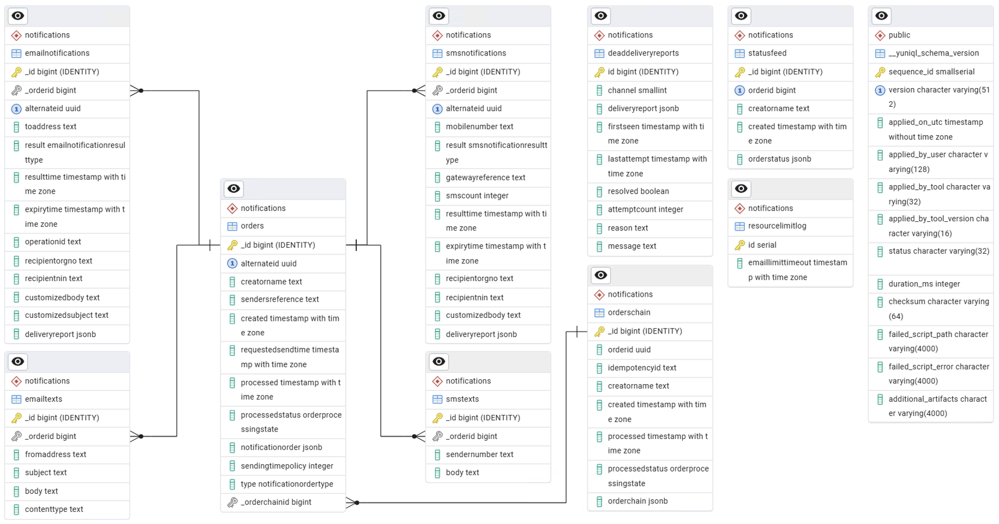

# Notifications

## API

### Public API

The following API controllers are defined:

- [OrdersController](https://github.com/Altinn/altinn-notifications/blob/main/components/api/src/Altinn.Notifications/Controllers/OrdersController.cs):
  API for retrieving one or more orders with or without processing details and notification summaries
- [EmailNotificationOrdersController](https://github.com/Altinn/altinn-notifications/blob/main/components/api/src/Altinn.Notifications/Controllers/EmailNotificationOrdersController.cs):
  API for placing new email notification order requests
- [EmailNotificationsController](https://github.com/Altinn/altinn-notifications/blob/main/components/api/src/Altinn.Notifications/Controllers/EmailNotificationsController.cs):
  API for retrieving email notifications related to a single order
- [SmsNotificationOrdersController](https://github.com/Altinn/altinn-notifications/blob/main/components/api/src/Altinn.Notifications/Controllers/SmsNotificationOrdersController.cs):
  API for placing new SMS notification order requests
- [SmsNotificationsController](https://github.com/Altinn/altinn-notifications/blob/main/components/api/src/Altinn.Notifications/Controllers/SmsNotificationsController.cs):
  API for retrieving SMS notifications related to a single order
- [FutureOrdersController](https://github.com/Altinn/altinn-notifications/blob/main/components/api/src/Altinn.Notifications/Controllers/FutureOrdersController.cs):
  API for placing scheduled notification orders (single or order chain with reminders)
- [InstantOrdersController](https://github.com/Altinn/altinn-notifications/blob/main/components/api/src/Altinn.Notifications/Controllers/InstantOrdersController.cs):
  API for placing instant email and SMS notifications dispatched synchronously via HTTP (no queue) — see [instant-notifications.md](instant-notifications.md)
- [ShipmentController](https://github.com/Altinn/altinn-notifications/blob/main/components/api/src/Altinn.Notifications/Controllers/ShipmentController.cs):
  API for shipment-related notification operations
- [StatusFeedController](https://github.com/Altinn/altinn-notifications/blob/main/components/api/src/Altinn.Notifications/Controllers/StatusFeedController.cs):
  API for retrieving a feed of notification status updates

### Internal API

The API controllers listed below are exclusively for use within the Altinn organization:

- [MetricsController](https://github.com/Altinn/altinn-notifications/blob/main/components/api/src/Altinn.Notifications/Controllers/MetricsController.cs):
  API for retrieving metrics over the use of the service

### Private API

The API controllers listed below are exclusively for use within the Notification solution:

- [TriggerController](https://github.com/Altinn/altinn-notifications/blob/main/components/api/src/Altinn.Notifications/Controllers/TriggerController.cs):
  Functionality to trigger the start of order and notifications processing flows
- [SendConditionController](https://github.com/Altinn/altinn-notifications/blob/main/components/api/src/Altinn.Notifications/Controllers/SendConditionController.cs):
  Provides endpoint to support automated testing of send conditions

## Database

Data related to notification orders, notifications and recipients is persisted in a PostgreSQL database.

Each table in the _notifications_ schema is described in the table below,
followed by a diagram showing the relation between the tables.

| Table               | Description                                                                                                          |
| ------------------- | -------------------------------------------------------------------------------------------------------------------- |
| orders              | Contains metadata for each notification order, including send time policy and order type                             |
| emailtexts          | Holds the template texts (subject, body, sender) for email notifications                                             |
| emailnotifications  | Holds metadata for each email notification, recipient contact details, customized content, and raw delivery report   |
| smstexts            | Holds the template texts (sender number, body) for SMS notifications                                                 |
| smsnotifications    | Holds metadata for each SMS notification, recipient contact details, customized content, and raw delivery report     |
| resourcelimitlog    | Keeps track of resource limit outages for dependent systems e.g. Azure Communication Services                        |
| orderschain         | Contains order chain metadata (main order + optional reminders) for scheduled notification requests                  |
| statusfeed          | Tracks the final status of each processed notification order, one entry per order, for status feed queries           |
| deaddeliveryreports | Stores delivery reports that could not be matched to a known notification, for investigation and reprocessing        |

## Integrations

### Azure Service Bus

The Notifications API has an integration towards Azure Service Bus, managed through the [Wolverine](https://wolverine.netlify.app/) framework.

**Handlers (consumers):**

- [ProcessPastDueOrderHandler](https://github.com/Altinn/altinn-notifications/blob/main/components/api/src/Altinn.Notifications.Integrations/Wolverine/Handlers/ProcessPastDueOrderHandler.cs):
  Processes notification orders that are ready to be dispatched
- [EmailSendResultHandler](https://github.com/Altinn/altinn-notifications/blob/main/components/api/src/Altinn.Notifications.Integrations/Wolverine/EmailSendResultHandler.cs):
  Consumes email send results from the email service and updates notification status
- [EmailDeliveryReportHandler](https://github.com/Altinn/altinn-notifications/blob/main/components/api/src/Altinn.Notifications.Integrations/Wolverine/Handlers/EmailDeliveryReportHandler.cs):
  Consumes ACS email delivery reports routed from Azure Event Grid
- [EmailServiceRateLimitHandler](https://github.com/Altinn/altinn-notifications/blob/main/components/api/src/Altinn.Notifications.Integrations/Wolverine/Handlers/EmailServiceRateLimitHandler.cs):
  Consumes service rate limit updates from the email service
- [SmsSendResultHandler](https://github.com/Altinn/altinn-notifications/blob/main/components/api/src/Altinn.Notifications.Integrations/Wolverine/SmsSendResultHandler.cs):
  Consumes SMS send results from the SMS service and updates notification status
- [SmsDeliveryReportHandler](https://github.com/Altinn/altinn-notifications/blob/main/components/api/src/Altinn.Notifications.Integrations/Wolverine/Handlers/SmsDeliveryReportHandler.cs):
  Consumes SMS delivery reports from the SMS service

**Publishers:**

- [PastDueOrderPublisher](https://github.com/Altinn/altinn-notifications/blob/main/components/api/src/Altinn.Notifications.Integrations/Wolverine/Publishers/PastDueOrderPublisher.cs):
  Publishes notification orders ready for processing
- [EmailCommandPublisher](https://github.com/Altinn/altinn-notifications/blob/main/components/api/src/Altinn.Notifications.Integrations/Wolverine/Publishers/EmailCommandPublisher.cs):
  Publishes email send commands to the email service
- [SendSmsCommandPublisher](https://github.com/Altinn/altinn-notifications/blob/main/components/api/src/Altinn.Notifications.Integrations/Wolverine/Publishers/SendSmsCommandPublisher.cs):
  Publishes SMS send commands to the SMS service

[Please reference the Azure Service Bus architecture section for a closer description of the ASB queue setup.](asb.md)

### Maskinporten

A Maskinporten integration has been created to ensure the application can create Maskinporten tokens for the
API clients to use as required.
Each client should have their own integration and their set of configuration values as seen in
[appsettings.json](https://github.com/Altinn/altinn-notifications/blob/main/components/api/src/Altinn.Notifications/appsettings.json).
Secrets are hosted in Azure Key Vault and added to the configuration values during startup of the application.

### REST clients

**Altinn APIs:**

The Notification microservice implements multiple API clients for communication with other services.
The clients are used to retrieve recipient data and to authorize user access.

- [ProfileClient](https://github.com/Altinn/altinn-notifications/blob/main/components/api/src/Altinn.Notifications.Integrations/Profile/ProfileClient.cs)
  consumes Altinn Profile's internal API to retrieve contact points for individuals.
- [RegisterClient](https://github.com/Altinn/altinn-notifications/blob/main/components/api/src/Altinn.Notifications.Integrations/Register/RegisterClient.cs)
  consumes Altinn Register's internal API to retrieve official and user-registered contact points associated with organizations.
  Additionally, it uses the same API to fetch the names of individuals and organizations when keywords are utilized.
- [AuthorizationService](https://github.com/Altinn/altinn-notifications/blob/main/components/api/src/Altinn.Notifications.Integrations/Authorization/AuthorizationService.cs)
  consumes Altinn Authorization's Decision API to verify that all users with registered contact points for an organization are authorized. The decision request will ask
  if a given user still has read access to the resource that the notification is about.

**External APIs:**

- [SendConditionClient](https://github.com/Altinn/altinn-notifications/blob/main/components/api/src/Altinn.Notifications.Integrations/SendCondition/SendConditionClient.cs)
  sends request to condition endpoints provided in notification orders with a Maskinporten token representing Digdir.

## Cron jobs

Multiple cron jobs have been set up to enable triggering of actions in the application on a schedule.

The following cron jobs are defined:

| Job name                       | Schedule        | Description                                                                                |
| ------------------------------ | --------------- | ------------------------------------------------------------------------------------------ |
| pending-orders-trigger         | `*/1 * * * *`   | Triggers processing of past due orders                                                     |
| send-email-trigger             | `*/1 * * * *`   | Triggers sending of all pending email notifications                                        |
| send-sms-trigger               | `* 7-16 * * *`  | Triggers sending of SMS notifications with daytime send time policy (business hours only)  |
| send-sms-trigger-anytime       | `*/1 * * * *`   | Triggers sending of SMS notifications with anytime send time policy (no time restriction)  |
| terminate-expired-trigger      | `*/15 * * * *`  | Terminates SMS and email notifications that have passed their expiry time                  |
| delete-old-status-feed-records | `*/5 2-5 * * *` | Deletes old status feed records during off-peak hours                                      |

Each cron job runs in a Docker container [based on the official docker image for curl](https://hub.docker.com/r/curlimages/curl)
and sends a request to an endpoint in the [TriggerController](https://github.com/Altinn/altinn-notifications/blob/main/components/api/src/Altinn.Notifications/Controllers/TriggerController.cs).

The specifications of the cron jobs are hosted in a [private repository in Azure DevOps](https://dev.azure.com/brreg/_git/altinn-studio-ops?path=/deploy/altinn-platform/altinn-notifications/templates/jobs)
(requires login).

## Dependencies

The microservice makes use of a range of external and Altinn services as well as .NET libraries to support the provided functionality.

### External Services

| Service                         | Purpose                                                        | Resources                                                                       |
| ------------------------------- | -------------------------------------------------------------- | ------------------------------------------------------------------------------- |
| Azure Service Bus               | Hosts the message queues                                       | [Documentation](https://azure.microsoft.com/en-us/products/service-bus)         |
| Azure Database for PostgreSQL   | Hosts the database                                             | [Documentation](https://azure.microsoft.com/en-us/products/postgresql)          |
| Azure API Management            | Manages access to public API                                   | [Documentation](https://azure.microsoft.com/en-us/products/api-management)      |
| Azure Monitor                   | Telemetry from the application is sent to Application Insights | [Documentation](https://azure.microsoft.com/en-us/products/monitor)             |
| Azure Key Vault                 | Safeguards secrets used by the microservice                    | [Documentation](https://azure.microsoft.com/en-us/products/key-vault)           |
| Azure Kubernetes Services (AKS) | Hosts the microservice and cron jobs                           | [Documentation](https://azure.microsoft.com/en-us/products/kubernetes-service/) |

### Altinn Services

| Service                     | Purpose                                                                                               | Resources                                                          |
| --------------------------- | ----------------------------------------------------------------------------------------------------- | ------------------------------------------------------------------ |
| Altinn Authorization        | Authorizes access to the API and resources                                                            | [Repository](https://github.com/altinn/altinn-authorization)       |
| Altinn Notifications Email* | Service for sending emails related to a notification                                                  | [Source](https://github.com/Altinn/altinn-notifications/tree/main/components/email-service/src) |
| Altinn Notifications SMS*   | Service for sending SMS related to a notification                                                     | [Source](https://github.com/Altinn/altinn-notifications/tree/main/components/sms-service/src)   |
| Altinn Profile              | Provides contact details for individuals                                                              | [Repository](https://github.com/altinn/altinn-profile)             |
| Altinn Register             | Provides official contact details for organizations and names for both individuals and organizations  | [Repository](https://github.com/altinn/altinn-register)            |

\*Functional dependency to enable the full functionality of Altinn Notifications.

### .NET Libraries

| Library                   | Purpose                                 | Resources                                                                                                                                 |
| ------------------------- | --------------------------------------- | ----------------------------------------------------------------------------------------------------------------------------------------- |
| AccessToken               | Used to validate tokens in requests     | [Repository](https://github.com/altinn/altinn-accesstoken), [Documentation](/authentication/reference/architecture/accesstoken)   |
| Altinn.Common.PEP         | Client code for Authorization           | [Repository](https://github.com/Altinn/altinn-authorization), [Documentation](/authorization/reference/architecture/)          |
| Altinn MaskinportenClient | Used to generate Maskinporten token     | [Repository](https://github.com/altinn/altinn-apiclient-maskinporten)                                                                     |
| FluentValidation          | Used to validate content of API request | [Repository](https://github.com/FluentValidation/FluentValidation), [Documentation](https://docs.fluentvalidation.net/en/latest/)         |
| JWTCookieAuthentication   | Used to validate Altinn token (JWT)     | [Repository](https://github.com/Altinn/altinn-authentication),  [Documentation](/authentication/reference/architecture/jwtcookie/) |
| libphonenumber-csharp     | Used to validate mobile numbers         | [Repository](https://github.com/caseykramer/libphonenumber-csharp), [Documentation](https://github.com/caseykramer/libphonenumber-csharp) |
| Npgsql                    | Used to access the database server      | [Repository](https://github.com/rdagumampan/yuniql), [Documentation](https://www.npgsql.org/)                                             |
| Wolverine                 | Messaging framework for ASB integration | [Repository](https://github.com/JasperFx/wolverine), [Documentation](https://wolverine.netlify.app/)                                     |
| Wolverine.AzureServiceBus | Azure Service Bus transport for Wolverine | [Repository](https://github.com/JasperFx/wolverine), [Documentation](https://wolverine.netlify.app/guide/messaging/transports/azureservicebus/) |
| Yuniql                    | DB migration                            | [Repository](https://github.com/rdagumampan/yuniql), [Documentation](https://yuniql.io/)                                                  |

[A full list of NuGet dependencies is available on GitHub](https://github.com/Altinn/altinn-notifications/network/dependencies).

## Testing

Quality gates implemented for a project require an 80% code coverage for the unit and integration tests combined.
[xUnit](https://xunit.net/) is the framework used and the [Moq library](https://github.com/moq) supports mocking parts of the solution.

### Unit tests

[The unit test project is available on GitHub](https://github.com/Altinn/altinn-notifications/tree/main/components/api/test/Altinn.Notifications.Tests).

### Integration tests

[The integration test project is available on GitHub](https://github.com/Altinn/altinn-notifications/tree/main/components/api/test/Altinn.Notifications.IntegrationTests).

Integration tests use [Testcontainers](https://dotnet.testcontainers.org/) to spin up dependencies automatically — no manual setup is required to run them.

### Automated tests

[The automated test project is available on GitHub](https://github.com/Altinn/altinn-notifications/tree/main/components/api/test/k6)

The automated tests for this micro service are implemented through [Grafana's k6](https://k6.io/).
The tool is specialized for load tests, but we do use it for automated API tests as well.
The test set is used for both use case and regression tests.

#### Use case tests

[All use case workflows are available on GitHub](https://github.com/Altinn/altinn-notifications/tree/main/.github/workflows)

Use case tests are run every 15 minutes through GitHub Actions.
The tests run during the use case tests are defined in the k6 test project.
The aim of the tests is to run through central functionality of the solution to ensure that it is running and available to our end users.

#### Regression tests

[All regression test workflows are available on GitHub](https://github.com/Altinn/altinn-notifications/tree/main/.github/workflows)

The regression tests are run once a week and 5 minutes after deploy to a given environment.
The tests run during the regression tests are defined in the k6 test project.
The aim of the regression tests is to cover as much of our functionality as possible,
to ensure that a new release does not break any existing functionality.

## Hosting

### Web API

The microservice runs in a Docker container hosted in AKS,
and it is deployed as a Kubernetes deployment with autoscaling capabilities.

The notifications application runs on port 5090.

See [DockerFile](https://github.com/Altinn/altinn-notifications/blob/main/components/api/Dockerfile) for details.

### Cron jobs

The cron jobs run in docker containers hosted in AKS, and are started on a schedule configured in the helm chart.
There is a policy in place to ensure that there are no concurrent pods of a singular job.

### Database

The database is hosted on a PostgreSQL flexible server in Azure.

## Build & deploy

### Web API

- Build and Code analysis runs in a [GitHub workflow](https://github.com/Altinn/altinn-notifications/actions)
- Build of the image is done in an [Azure DevOps Pipeline](https://dev.azure.com/brreg/altinn-studio/_build?definitionId=383)
- Deploy of the image is enabled with Helm and implemented in an [Azure DevOps Release pipeline](https://dev.azure.com/brreg/altinn-studio/_release?_a=releases&view=all&definitionId=49)

### Cron jobs

Deploy of the cron jobs is enabled with Helm and implemented in the same pipeline that deploys the web API.

### Database

- Migration scripts are copied into the Docker image of the web API when this is built
- Execution of the scripts is on startup of the application and enabled by [YUNIQL](https://yuniql.io/)

## Run on local machine

Instructions on how to set up the service on local machine for development or testing is covered by
[Getting Started](https://github.com/Altinn/altinn-notifications/blob/main/getting-started.md).

For local development with ASB, a [Docker Compose file](https://github.com/Altinn/altinn-notifications/blob/main/tools/asb-emulator/docker-compose.yaml) is available to start the Azure Service Bus Emulator locally.
